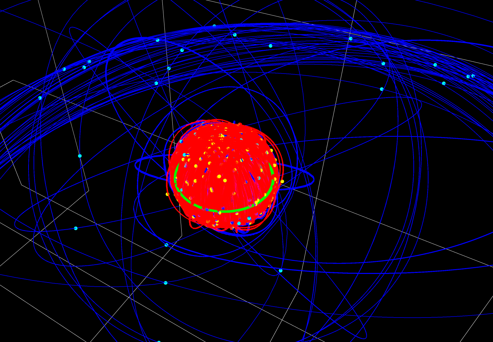
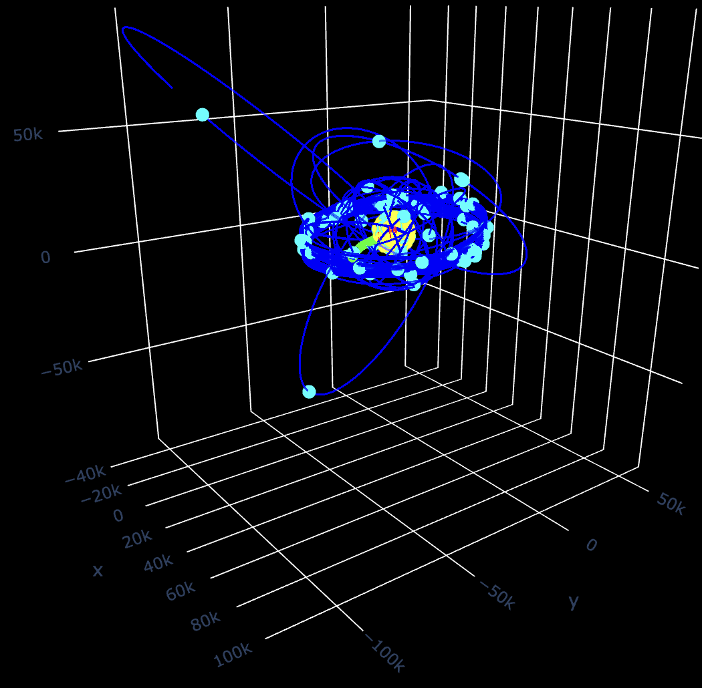
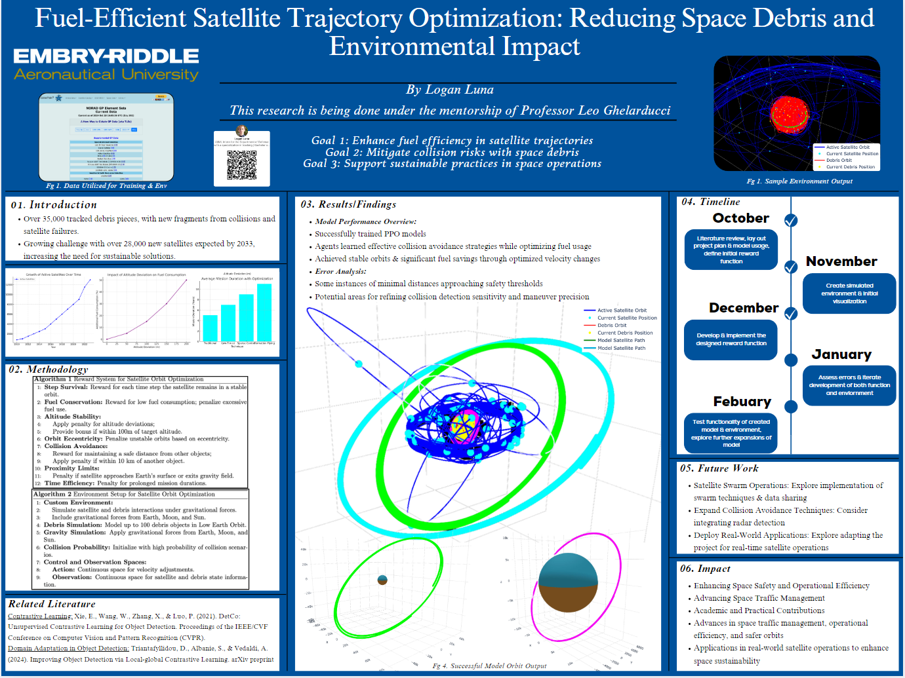

# Satellite Trajectory Projection and Collision Avoidance

## Overview

This project implements an AI-powered satellite trajectory projection and collision avoidance system using reinforcement learning. It combines real-world satellite tracking data (TLE - Two-Line Element sets) with a Proximal Policy Optimization (PPO) model to predict and avoid potential collisions with space debris and other satellites.

## Features

- **Real-time TLE Data Fetching**: Retrieves up-to-date satellite and debris data from CelesTrak.
- **3D Visualization**: Provides an interactive 3D environment to visualize satellite orbits and debris.
- **AI-powered Collision Avoidance**: Utilizes a PPO model to dynamically avoid collisions.
- **Dynamic Orbit Scaling**: Adjusts orbit scales for improved visualization.
- **Gravitational Influence Modeling**: Accounts for Earth's and Moon's gravitational effects on satellite orbits.
- **Performance Metrics Tracking**: Logs and analyzes performance metrics during simulations.





## Demo

### Animation
[View Animation](misc/gen_media/animation.html)
<iframe src="misc/gen_media/animation.html" width="600" height="400" title="Animation"></iframe>

### Video Demonstration


<video width="600" controls>
  <source src="misc/gen_media/animation.mp4" type="video/mp4">
  Your browser does not support the video tag.
</video>

## Prerequisites

- **Python 3.8+**
- **pip** package manager

## Installation

1. **Clone the Repository**
   ```bash
   git clone https://github.com/Logan-Cole-Luna/sat-trajectory-avoidance
   cd SatProjection
   ```

2. **Install Dependencies**
   ```bash
   pip install -r requirements.txt
   ```

## Usage

### Download TLE Data from CelesTrack
```bash
python tle_export.py
```

### Implement and Run the pretrained Satellite Model

```bash
python implement_sat.py
```

### Train Your Own Satellite Model

```bash
python train_sat.py
```

## Data
The project uses TLE data from CelesTrak, stored in the tle_data/ directory. Ensure the TLE files are up-to-date for accurate simulations.

## Performance Metrics
Performance metrics such as collision counts, reward accumulation, delta-v usage, and minimum distances to debris are logged and can be reviewed to evaluate the model's effectiveness.