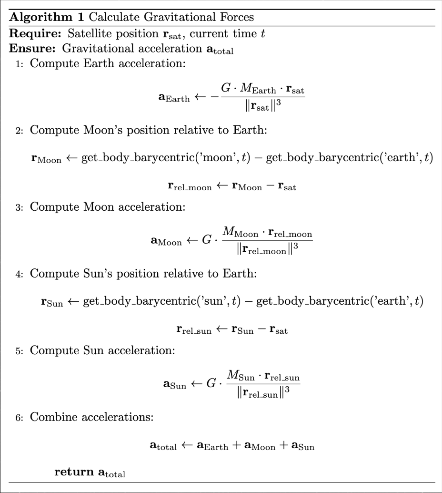

# Satellite Trajectory Projection and Collision Avoidance

[](LICENSE)
[](https://www.python.org/downloads/release/python-380/)

## Table of Contents
- [Overview](#overview)
- [Features](#features)
- [Environment Setup](#environment-setup)
- [Installation](#installation)
- [Usage](#usage)
- [Data](#data)
- [Performance Metrics](#performance-metrics)
- [Environment Design & Setup](#environment-design--setup)
- [Reward Function Design](#reward-function-design)
- [Current Results](#current-results)
- [Credits](#credits)

## Overview

This project implements an AI-powered satellite trajectory projection and collision avoidance system using reinforcement learning. It combines real-world satellite tracking data (TLE - Two-Line Element sets) with a Proximal Policy Optimization (PPO) model to predict and avoid potential collisions with space debris and other satellites.

## Features

- **Real-time TLE Data Fetching**: Retrieves up-to-date satellite and debris data from CelesTrak.
- **3D Visualization**: Provides an interactive 3D environment to visualize satellite orbits and debris.
- **AI-powered Collision Avoidance**: Utilizes a PPO model to dynamically avoid collisions.
- **Dynamic Orbit Scaling**: Adjusts orbit scales for improved visualization.
- **Gravitational Influence Modeling**: Accounts for Earth's and Moon's gravitational effects on satellite orbits.
- **Performance Metrics Tracking**: Logs and analyzes performance metrics during simulations.


### Video Demonstration of Training


## Prerequisites

- **Python 3.8+**
- **pip** package manager

## Installation

1. **Clone the Repository**
   ```bash
   git clone https://github.com/Logan-Cole-Luna/sat-trajectory-avoidance
   cd sat-trajectory-avoidance
   ```

2. **Create Virtual Environment**
   ```bash
   python -m venv venv
   source venv/bin/activate  # On Windows: venv\Scripts\activate
   ```

3. **Install Dependencies**
   ```bash
   pip install -r requirements.txt
   ```

## Usage

### Download TLE Data from CelesTrack
```bash
python tle_export.py
```

### Implement and Run the pretrained Satellite Model

```bash
python implement_sat.py
```

### Train Your Own Satellite Model

```bash
python train_sat.py
```

## Data
The project uses TLE data from CelesTrak, stored in the tle_data/ directory. Ensure the TLE files are up-to-date for accurate simulations.

## Performance Metrics
Performance metrics such as collision counts, reward accumulation, delta-v usage, and minimum distances to debris are logged and can be reviewed to evaluate the model's effectiveness.

## Environment Design & Setup:



## Reward Function Design


## Current Results

### Baseline Function For Evaluation:


- **Velocity Adjustment**: Adjusts velocity away from the nearest debris object if it is within a defined unsafe distance.
- **No Action**: Maintains current trajectory if no debris is within the unsafe distance.

### Model Performance Overview
- **Collision Reduction**: Agents learned effective collision avoidance strategies, resulting in a 7.69% reduction in collision rate compared to the baseline policy.
- **Orbit Stability**: Achieved stable orbits with 15.89% fewer steps on average, utilizing optimized velocity changes to reduce mission duration.

### Error Analysis
- **Delta-v Efficiency**: While prioritizing collision avoidance, the PPO models consumed more delta-v than the baseline.
- **Collision Detection Sensitivity**: Needs refinement for better accuracy.
- **Reward Function**: Currently unbalanced and requires adjustments.
- **Documentation**: Additional documentation on fuel metrics is necessary.

## Credits
- **Data Sources**: Credit to [Celestrak](https://celestrak.com/) for providing TLE data.